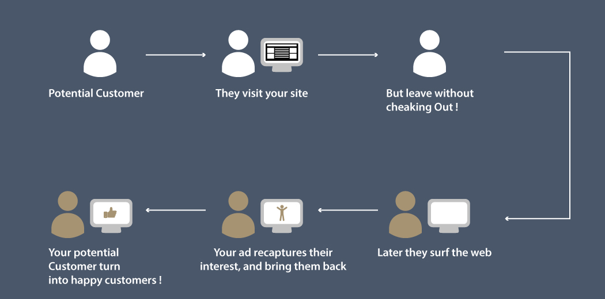

# AV-WNS Analytics Wizard 2019-Hackathon
**Approach and Codes for the Analytics Vidhya WNS Analytics Wizard 2019 Hackathon**
## Competition Link
https://datahack.analyticsvidhya.com/contest/wns-analytics-wizard-2019/
## Problem Statement
Zbay is an E-commerce website which sells a variety of products at its online platform. Zbay records user behaviour of its customers and stores it as a log. However, most of the times, users do not buy the products instantly and there is a time gap during which the customer might surf the internet and maybe visit competitor websites.

 

Now, to improve sales of products, Zbay has hired Adiza, an Adtech company which built a system such that ads are being shown for Zbay’s products on its partner websites.

 

If a user comes to Zbay’s website and searches for a product, and then visits these partner websites or apps, his/her previously viewed items or their similar items are shown on as an ad. If the user clicks this ad, he/she will be redirected to the Zbay’s website and might buy the product.

In this problem, the task was to predict click probability i.e. probability of user clicking the ad which is shown to them on the partner websites for the next 7 days on the basis of historical view log data, ad impression data and user data.

## Available Data Sources:
* View Logs- View data of Users at an User level containing various information such as User ID, Item ID, Timestamp of view, Device used etc
* Item Logs- Item data containing various details about each item on the merchant website catalog
* Train data- Actual click information data

## Approach 
**(placeholder)**

## Final Ranks Obtained
Public Leaderbaord-
  Private Leaderboard- 
